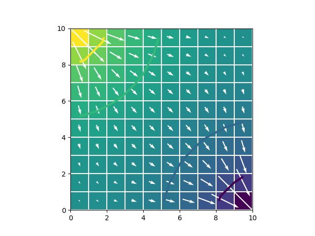

### Version 3.3.4
[](https://travis-ci.org/modflowpy/flopy)
[](https://codecov.io/gh/modflowpy/flopy)
[](https://www.codacy.com/manual/jdhughes-usgs/flopy?utm_source=github.com&amp;utm_medium=referral&amp;utm_content=modflowpy/flopy&amp;utm_campaign=Badge_Grade)
[](https://flopy.readthedocs.io/en/latest/?badge=latest)

[](https://conda.anaconda.org/conda-forge)
[](https://anaconda.org/conda-forge/flopy)
[](https://pypi.python.org/pypi/flopy)

[](https://mybinder.org/v2/gh/modflowpy/flopy.git/master)

Introduction
-----------------------------------------------

FloPy includes support for [MODFLOW 6](docs/mf6.md), MODFLOW-2005, MODFLOW-NWT, MODFLOW-USG, and MODFLOW-2000. Other supported MODFLOW-based models include MODPATH (version 6 and 7), MT3DMS, MT3D-USGS, and SEAWAT.

For general modeling issues, please consult a modeling forum, such as the [MODFLOW Users Group](https://groups.google.com/forum/#!forum/modflow).  Other MODFLOW resources are listed in the [MODFLOW Resources](https://github.com/modflowpy/flopy#modflow-resources) section.


Installation
-----------------------------------------------

FloPy requires **Python** 3.5 (or higher) and **NumPy** 1.9 (or higher).  Dependencies for optional FloPy methods are summarized [here](docs/flopy_method_dependencies.md).

To install FloPy type:

    conda install -c conda-forge flopy

or

    pip install flopy


The release candidate version can also be installed from the git repository using the instructions provided [below](#relcand).


Documentation
-----------------------------------------------

Documentation is available on **Read the Docs** and includes information
on FloPy; tutorials for using FloPy with MODFLOW 6 and previous versions
of MODFLOW, MT3DMS, MT3D-USGS, MODPATH, and ZONEBUDGET; and code documentation.

 - Read the Docs for the [latest release](https://flopy.readthedocs.io).
 - Read the Docs for the [current release candidate](https://flopy.readthedocs.io/en/latest/).


Getting Started
-----------------------------------------------

### MODFLOW 6 Quick Start

```python
import os
import flopy
ws = './mymodel'
name = 'mymodel'
sim = flopy.mf6.MFSimulation(sim_name=name, sim_ws=ws, exe_name='mf6')
tdis = flopy.mf6.ModflowTdis(sim)
ims = flopy.mf6.ModflowIms(sim)
gwf = flopy.mf6.ModflowGwf(sim, modelname=name, save_flows=True)
dis = flopy.mf6.ModflowGwfdis(gwf, nrow=10, ncol=10)
ic = flopy.mf6.ModflowGwfic(gwf)
npf = flopy.mf6.ModflowGwfnpf(gwf, save_specific_discharge=True)
chd = flopy.mf6.ModflowGwfchd(gwf, stress_period_data=[[(0, 0, 0), 1.],
                                                       [(0, 9, 9), 0.]])
budget_file = name + '.bud'
head_file = name + '.hds'
oc = flopy.mf6.ModflowGwfoc(gwf,
                            budget_filerecord=budget_file,
                            head_filerecord=head_file,
                            saverecord=[('HEAD', 'ALL'), ('BUDGET', 'ALL')])
sim.write_simulation()
sim.run_simulation()

head = gwf.output.head().get_data()
bud = gwf.output.budget()

spdis = bud.get_data(text='DATA-SPDIS')[0]
pmv = flopy.plot.PlotMapView(gwf)
pmv.plot_array(head)
pmv.plot_grid(colors='white')
pmv.contour_array(head, levels=[.2, .4, .6, .8], linewidths=3.)
pmv.plot_specific_discharge(spdis, color='white')
```



Additional FloPy Resources
------------------------------------------------

- [Tutorials](https://flopy.readthedocs.io/en/latest/tutorials.html) demonstrating basic FloPy use.

- [MODFLOW 6 Example Problems](https://modflow6-examples.readthedocs.io/en/latest/) demonstrating FloPy use to create, run, and post-process MODFLOW 6 models.

- [Jupyter notebooks](docs/notebook_examples.md) demonstrating the use of FloPy pre- and post-processing capabilities with a variety of MODFLOW-based models.

- [Scripts](docs/script_examples.md) demonstrating the use of FloPy for running and post-processing MODFLOW-based models.

- A list of supported packages in FloPy is available in [docs/supported_packages.md](docs/supported_packages.md) on the github repo.

- A table of the supported and proposed model checks implemented in  FloPy is available in [docs/model_checks.md](docs/model_checks.md) on the github repo.

- A summary of changes in each FloPy version is available in [docs/version_changes.md](docs/version_changes.md) on the github repo.

Questions
------------------------------------------------
FloPy usage has been growing rapidly, and as the number of users has increased, so has the number of questions about how to use FloPy.  We ask our users to carefully consider the nature of their problem and seek help in the appropriate manner.

Do not open issues for general support questions as we want to keep GitHub issues for bug reports and feature requests. You've got much better chances of getting your question answered on [Stack Overflow](https://stackoverflow.com/questions/tagged/flopy) where the questions should be tagged with tag `flopy` or the [MODFLOW google group](https://groups.google.com/forum/#!forum/modflow).

Stack Overflow is a much better place to ask questions since:

- there are thousands of people willing to help on Stack Overflow and the MODFLOW google group
- questions and answers stay available for public viewing so your question / answer might help someone else
- Stack Overflow's voting system assures that the best answers are prominently visible.

To save your and our time, **we will systematically close all issues that are requests for general support and redirect people to Stack Overflow or the MODFLOW google group**.


Contributing
------------------------------------------------

Bug reports, code contributions, or improvements to the documentation are welcome from the community. Prior to contributing, please read up on our guidelines for [contributing](CONTRIBUTING.md) and then check out one of our issues in the [hotlist: community-help](https://github.com/modflowpy/flopy/labels/hotlist%3A%20community%20help).


<a name="relcand"></a>Installing the latest FloPy release candidate
------------------------------------------------

To install the latest release candidate type:

    pip install https://github.com/modflowpy/flopy/zipball/develop


How to Cite
-----------------------------------------------

##### ***Citation for FloPy:***

[Bakker, Mark, Post, Vincent, Langevin, C. D., Hughes, J. D., White, J. T., Starn, J. J. and Fienen, M. N., 2016, Scripting MODFLOW Model Development Using Python and FloPy: Groundwater, v. 54, p. 733–739, doi:10.1111/gwat.12413.](http://dx.doi.org/10.1111/gwat.12413)

##### ***Software/Code citation for FloPy:***

[Bakker, Mark, Post, Vincent, Hughes, J. D., Langevin, C. D., White, J. T., Leaf, A. T., Paulinski, S. R., Bellino, J. C., Morway, E. D., Toews, M. W., Larsen, J. D., Fienen, M. N., Starn, J. J., and Brakenhoff, Davíd, 2021, FloPy v3.3.4: U.S. Geological Survey Software Release, 06 August 2021, http://dx.doi.org/10.5066/F7BK19FH](http://dx.doi.org/10.5066/F7BK19FH)


MODFLOW Resources
-----------------------------------------------

+ [MODFLOW and Related Programs](http://water.usgs.gov/ogw/modflow/)
+ [Online guide for MODFLOW-2000](http://water.usgs.gov/nrp/gwsoftware/modflow2000/Guide/index.html)
+ [Online guide for MODFLOW-2005](http://water.usgs.gov/ogw/modflow/MODFLOW-2005-Guide/)
+ [Online guide for MODFLOW-NWT](http://water.usgs.gov/ogw/modflow-nwt/MODFLOW-NWT-Guide/)


Disclaimer
----------

This software has been approved for release by the U.S. Geological Survey
(USGS). Although the software has been subjected to rigorous review, the USGS
reserves the right to update the software as needed pursuant to further analysis
and review. No warranty, expressed or implied, is made by the USGS or the U.S.
Government as to the functionality of the software and related material nor
shall the fact of release constitute any such warranty. Furthermore, the
software is released on condition that neither the USGS nor the U.S. Government
shall be held liable for any damages resulting from its authorized or
unauthorized use.

