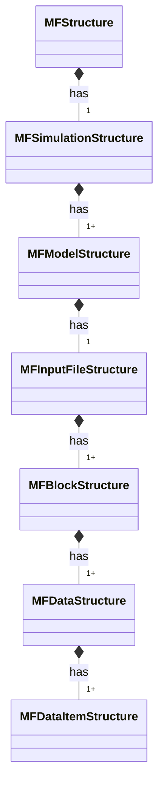
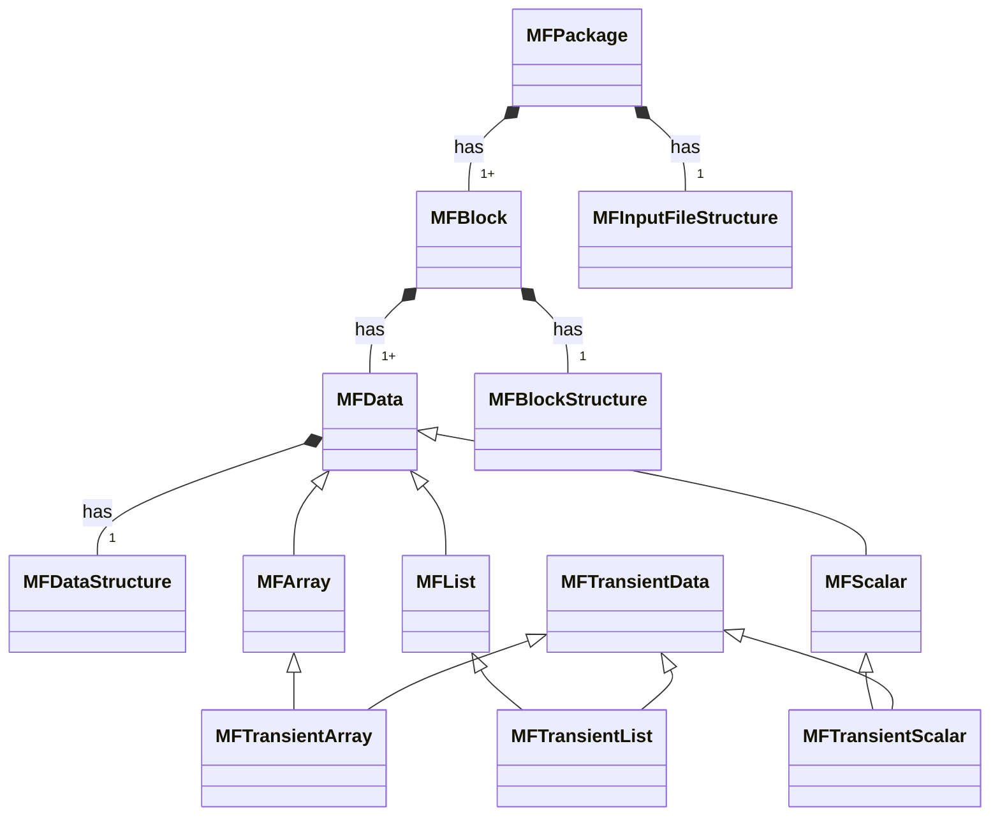

# Developing FloPy for MF6

<!-- START doctoc generated TOC please keep comment here to allow auto update -->
<!-- DON'T EDIT THIS SECTION, INSTEAD RE-RUN doctoc TO UPDATE -->

- [Introduction](#introduction)
- [Code generation](#code-generation)
- [Input specification](#input-specification)

<!-- END doctoc generated TOC please keep comment here to allow auto update -->

## Introduction

This file provides an overview of how FloPy's MODFLOW 6 module `flopy.mf6` works under the hood. It is intended for FloPy maintainers, as well as anyone who wants to add a new package, new model, or new features to this library.

## Code generation

MODFLOW 6 describes its input specification with definition (DFN) files.

Definition files describe components (e.g. simulations, models, packages) in the MODFLOW 6 input hierarchy. Definition files are used to generate both source code and documentation.

FloPy can generate a MODFLOW 6 compatibility layer for itself, given a set of definition files:

- `flopy/mf6/utils/createpackages.py`: assumes definition files are in `flopy/mf6/data/dfn`
- `flopy/mf6/utils/generate_classes.py`: downloads DFNs then runs `createpackages.py`

For instance, to sync with DFNs from the MODFLOW 6 develop branch:

```shell
python -m flopy.mf6.utils.generate_classes --ref develop --no-backup
```

Generated files are created in `flopy/mf6/modflow/`.

The code generation utility downloads DFN files, loads them, and uses Jinja to generate corresponding source files. A definition file typically maps 1-1 to a source file and component class, but 1-many is also possible (e.g. a model definition file yields a model class/file and namefile package class/file).

**Note**: Code generation requires a few extra dependencies, grouped in the `codegen` optional dependency group: `Jinja2` and `modflow-devtools`.

## Input specification

The `flopy.mf6.data.mfstructure.MFStructure` class represents an input specification. The class is a singleton, meaning only one instance of this class can be created.  The class contains a sim_struct attribute (which is a flopy.mf6.data.mfstructure.MFSimulationStructure object) which contains all of the meta-data for all package files.  Meta-data is stored in a structured format. MFSimulationStructure contains MFModelStructure and MFInputFileStructure objects, which contain the meta-data for each model type and each "simulation-level" package (tdis, ims, ...).  MFModelStructure contains model specific meta-data and a MFInputFileStructure object for each package in that model.  MFInputFileStructure contains package specific meta-data and a MFBlockStructure object for each block contained in the package file.  MFBlockStructure contains block specific meta-data and a MFDataStructure object for each data structure defined in the block, and MFDataStructure contains data structure specific meta-data and a MFDataItemStructure object for each data item contained in the data structure.  Data structures define the structure of data that is naturally grouped together, for example, the data in a numpy recarray.  Data item structures define the structure of specific pieces of data, for example, a single column of a numpy recarray.  The meta-data defined in these classes provides all the information FloPy needs to read and write MODFLOW 6 package and name files, create the Flopy interface, and check the data for various constraints.



Figure 1: Generic data structure hierarchy.  Connections show composition relationships.

The package and data classes are related as shown below in figure 2.  On the top of the figure 2 is the MFPackage class, which is the base class for all packages.  MFPackage contains generic methods for building data objects and reading and writing the package to a file.  MFPackage contains a MFInputFileStructure object that defines how the data is structured in the package file.  MFPackage also contains a dictionary of blocks (MFBlock).  The MFBlock class is a generic class used to represent a block within a package.  MFBlock contains a MFBlockStructure object that defines how the data in the block is structured.  MFBlock also contains a dictionary of data objects (subclasses of MFData) contained in the block and a list of block headers (MFBlockHeader) for that block.  Block headers contain the block's name and optionally data items (eg. iprn).


							 
Figure 2:  FPMF6 package and data classes.  Lines connecting classes show a relationship defined between the two connected classes.  A "*" next to the class means that the  class is a sub-class of the connected class.  A "+" next to the class means that the class is contained within the connected class.

There are three main types of data, MFList, MFArray, and MFScalar data.  All three of these data types are derived from the MFData abstract base class.  MFList data is the type of data stored in a spreadsheet with different column headings.  For example, the data describing a flow barrier are of type MFList.  MFList data is stored in numpy recarrays.  MFArray data is data of a single type (eg. all integer values).  For example, the model's HK values are of type MFArray.  MFArrays are stored in numpy ndarrays.  MFScalar data is a single data item.  Most MFScalar data are options.  All MFData subclasses contain an MFDataStructure object that defines the expected structure and types of the data.

Transient data, or data defined for each stress period (eg. data in the period blocks) is stored in MFTransientArray, MFTransientList, and MFTransientScalar.  These classes are sub-classes of MFArray, MFList, and MFScalar, respectively.  These classes are also subclasses of MFTransientData.
